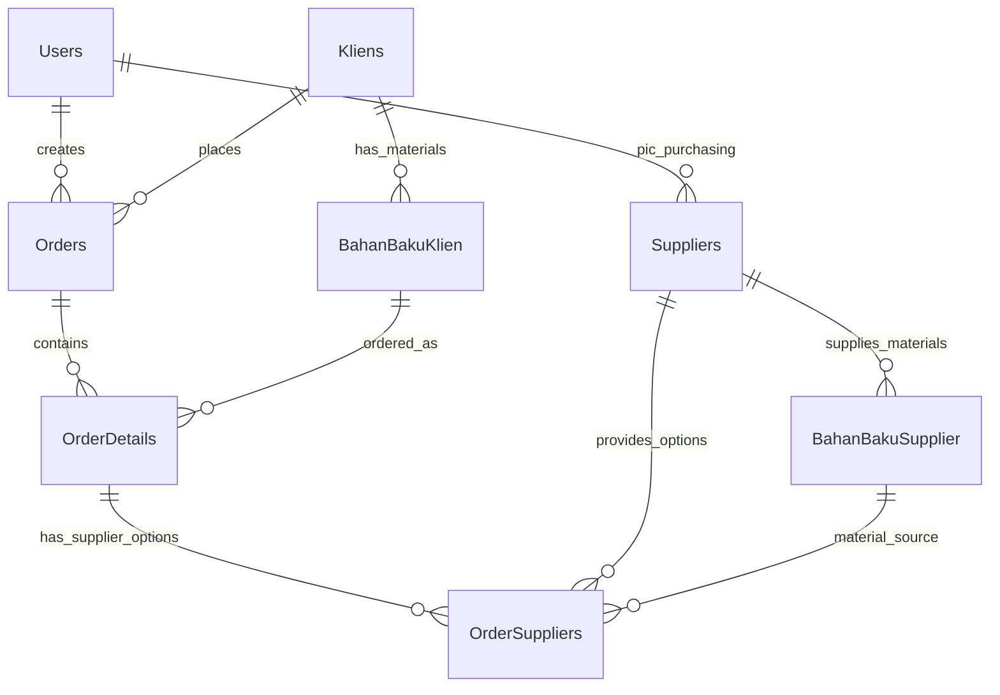

# 🗃️ **Complete Database Relationship Flow: Order Creation System**

**Last Updated:** November 14, 2025  
**System:** Laravel 12 + Livewire Order Management  
**Branch:** penawaran-pro-max  

---

## **📋 Core Entity Relationships**

### **1. Primary Entities Overview**


### **2. Database Tables Structure**

#### **Core Tables:**
- `users` - System users (marketing, purchasing, etc.)
- `kliens` - Client companies with their branches
- `orders` - Order headers with PO information
- `order_details` - Individual order line items (single material per order)
- `order_suppliers` - Auto-populated supplier options for each order detail
- `suppliers` - Supplier master data
- `bahan_baku_klien` - Client materials catalog
- `bahan_baku_supplier` - Supplier materials with pricing

---

## **🔄 Order Creation Database Flow**

### **Phase 1: Order Header Creation**

**Table:** `orders`

```sql
INSERT INTO orders (
    -- Identity & Ownership
    no_order,                       -- Auto-generated unique order number
    klien_id,                       -- FK to kliens table
    created_by,                     -- FK to users table (marketing user)
    tanggal_order,                  -- Order date
    
    -- Purchase Order Information
    po_number,                      -- Client's PO number
    po_start_date,                  -- PO validity start date
    po_end_date,                    -- PO validity end date  
    po_document_path,               -- Uploaded PO document storage path
    po_document_original_name,      -- Original PO filename
    
    -- Order Management
    priority,                       -- enum: rendah|normal|tinggi|mendesak
    catatan,                        -- General order notes
    status,                         -- enum: draft|dikonfirmasi|diproses|sebagian_dikirim|selesai|dibatalkan
    
    -- Auto-calculated Totals (updated from order_details)
    total_amount,                   -- Sum of all order_details.total_harga
    total_items,                    -- Count of order_details records
    total_qty,                      -- Sum of all order_details.qty
    
    -- Workflow Timestamps
    dikonfirmasi_at,                -- When order was confirmed
    selesai_at,                     -- When order was completed
    dibatalkan_at,                  -- When order was cancelled
    alasan_pembatalan,              -- Cancellation reason
    priority_calculated_at,         -- When priority was last calculated
    
    created_at,
    updated_at
);
```

**Key Constraints:**
- `no_order` - UNIQUE index
- `klien_id` - Foreign key to kliens table
- `created_by` - Foreign key to users table
- Composite indexes on (klien_id, status), (created_by, tanggal_order), (status, created_at)

---

### **Phase 2: Material Selection & Order Detail Creation**

**Table:** `order_details`

```sql
INSERT INTO order_details (
    -- Basic Order Information
    order_id,                       -- FK to orders table
    bahan_baku_klien_id,            -- FK to bahan_baku_klien (selected material)
    
    -- Quantity & Pricing
    qty,                            -- Quantity ordered (decimal 10,2)
    satuan,                         -- Unit of measurement (string)
    harga_jual,                     -- Selling price to client (decimal 12,2)
    total_harga,                    -- qty * harga_jual (decimal 15,2)
    
    -- Material Specifications
    spesifikasi_khusus,             -- Special material specifications (text)
    catatan,                        -- Item-specific notes (text)
    
    -- Status Tracking
    status,                         -- enum: menunggu|diproses|sebagian_dikirim|selesai
    
    -- AUTO-POPULATED SUPPLIER ANALYSIS FIELDS:
    -- Price Analysis (populated from order_suppliers)
    cheapest_price,                 -- MIN(order_suppliers.unit_price) - decimal 12,2
    most_expensive_price,           -- MAX(order_suppliers.unit_price) - decimal 12,2
    recommended_price,              -- unit_price from recommended supplier - decimal 12,2
    
    -- Margin Analysis
    best_margin_percentage,         -- MAX(calculated_margin) - decimal 5,2
    worst_margin_percentage,        -- MIN(calculated_margin) - decimal 5,2  
    recommended_margin_percentage,  -- margin from recommended supplier - decimal 5,2
    
    -- Supplier Summary
    available_suppliers_count,      -- COUNT(order_suppliers WHERE is_available=true) - integer
    recommended_supplier_id,        -- FK to suppliers (best margin/price option)
    
    -- FULFILLMENT TRACKING (updated from pengiriman system):
    total_shipped_quantity,         -- Sum from all order_suppliers.shipped_quantity - decimal 10,2
    remaining_quantity,             -- qty - total_shipped_quantity - decimal 10,2
    suppliers_used_count,           -- COUNT(order_suppliers WHERE has_been_used=true) - integer
    qty_shipped,                    -- Legacy field = total_shipped_quantity - decimal 10,2
    
    -- AUTO-POPULATION METADATA:
    supplier_options_populated,     -- Boolean flag indicating if suppliers were auto-populated
    options_populated_at,           -- Timestamp when supplier options were populated
    
    created_at,
    updated_at
);
```

**Key Constraints:**
- `order_id` - Foreign key to orders table (CASCADE DELETE)
- `bahan_baku_klien_id` - Foreign key to bahan_baku_klien table (CASCADE DELETE)
- `recommended_supplier_id` - Foreign key to suppliers table (SET NULL)
- Composite indexes on (order_id, status), (bahan_baku_klien_id, supplier_id)

---

### **Phase 3: Automatic Supplier Population**

**Table:** `order_suppliers` *(Auto-populated via `OrderDetail::populateSupplierOptions()`)*

```sql
-- For each matching supplier found by the auto-population algorithm:
INSERT INTO order_suppliers (
    -- Relationships
    order_detail_id,                -- FK to order_details table
    supplier_id,                    -- FK to suppliers table  
    bahan_baku_supplier_id,         -- FK to bahan_baku_supplier (material-supplier link)
    
    -- Pricing Information (copied from bahan_baku_supplier)
    unit_price,                     -- Price per unit from bahan_baku_supplier.harga_per_satuan - decimal 15,2
    
    -- AUTO-CALCULATED ANALYSIS:
    calculated_margin,              -- (harga_jual - unit_price) / harga_jual * 100 - decimal 8,4
    potential_profit,               -- harga_jual - unit_price - decimal 15,2
    price_rank,                     -- 1=cheapest, 2=second cheapest, etc. - integer
    is_recommended,                 -- true for best option (rank 1) - boolean
    
    -- AVAILABILITY STATUS:
    is_available,                   -- true (all auto-populated suppliers are available) - boolean
    has_been_used,                  -- false initially, updated when PO is created - boolean
    
    -- FULFILLMENT TRACKING (updated later by pengiriman system):
    shipped_quantity,               -- Actual quantity delivered by this supplier - decimal 15,2
    shipped_amount,                 -- shipped_quantity * unit_price - decimal 15,2
    
    -- METADATA:
    price_updated_at,               -- Timestamp when price was captured from bahan_baku_supplier
    
    created_at,
    updated_at
);
```

**Key Constraints:**
- `order_detail_id` - Foreign key to order_details table (CASCADE DELETE)
- `supplier_id` - Foreign key to suppliers table (CASCADE DELETE)
- `bahan_baku_supplier_id` - Foreign key to bahan_baku_supplier table (CASCADE DELETE)
- UNIQUE constraint on (order_detail_id, supplier_id) - prevents duplicate supplier options
- Indexes on (order_detail_id, is_available), (supplier_id, has_been_used), (price_rank, calculated_margin)

---

## **🔍 Supplier Auto-Population Algorithm**

### **Material Matching Logic**
```php
// Implemented in: OrderDetail::populateSupplierOptions()

STEP 1: Extract Material Information
    - Get material name from bahan_baku_klien.nama
    - Extract first word for broader matching capability
    - Example: "Semen Portland" -> first_word = "Semen"

STEP 2: Find Matching Suppliers
    Query: SELECT * FROM bahan_baku_supplier 
           WHERE nama LIKE '%{full_material_name}%' 
              OR nama LIKE '%{first_word}%'
    - Loads supplier relationship data
    - Gets current pricing from harga_per_satuan field

STEP 3: Price Ranking & Analysis
    - Sort suppliers by harga_per_satuan (ascending = cheapest first)
    - Assign price_rank: 1 = cheapest, 2 = second cheapest, etc.
    - Set is_recommended = true for rank 1 (cheapest supplier)
    - Calculate margins against order_detail.harga_jual

STEP 4: Create Order Supplier Records
    - Insert order_suppliers record for each matching supplier
    - Set calculated_margin and potential_profit
    - Mark all as is_available = true, has_been_used = false
    - Capture price_updated_at timestamp

STEP 5: Update Order Detail Summary
    - Calculate cheapest_price, most_expensive_price
    - Set recommended supplier and pricing fields  
    - Update margin analysis fields
    - Set available_suppliers_count
    - Mark supplier_options_populated = true
```

### **Example Auto-Population Flow:**
```
Order Detail: "Semen Portland, 100 ton, Rp 500,000/ton"

Found Suppliers:
1. Supplier A: Semen Portland - Rp 450,000/ton (rank=1, recommended=true, margin=11.11%)
2. Supplier B: Semen Gresik   - Rp 470,000/ton (rank=2, recommended=false, margin=6.38%)  
3. Supplier C: Semen Bosowa   - Rp 480,000/ton (rank=3, recommended=false, margin=4.17%)

Order Detail Updated:
- cheapest_price = 450,000
- most_expensive_price = 480,000
- recommended_price = 450,000
- best_margin_percentage = 11.11
- worst_margin_percentage = 4.17
- recommended_margin_percentage = 11.11
- available_suppliers_count = 3
- recommended_supplier_id = Supplier A's ID
```

---

## **📊 Key Relationships Breakdown**

### **1. Client → Order → Material Flow**
```
kliens (id) 
    ↓ 1:M relationship
orders (klien_id)
    ↓ 1:M relationship  
order_details (order_id)
    ↓ M:1 relationship
bahan_baku_klien (id) ← bahan_baku_klien_id
    ↓ M:1 relationship  
kliens (id) ← klien_id

BUSINESS RULE: Each client can have multiple orders, 
each order currently contains one material (single order_detail record).
```

### **2. Supplier Auto-Population Flow**
```
order_details (id)
    ↓ 1:M relationship
order_suppliers (order_detail_id) -- AUTO-POPULATED
    ↓ M:1 relationship
suppliers (id) ← supplier_id
    ↓ 1:M relationship
bahan_baku_supplier (supplier_id)
    ↓ 1:1 relationship back to
order_suppliers (bahan_baku_supplier_id)

BUSINESS RULE: When an order_detail is created, the system automatically 
finds all suppliers with matching materials and populates order_suppliers table.
```

### **3. User & Authorization Flow**
```
users (id)
    ↓ 1:M relationship
orders (created_by) -- Order creator (marketing user)
    
users (id)
    ↓ 1:M relationship    
suppliers (pic_purchasing_id) -- Purchasing contact person per supplier

BUSINESS RULE: Marketing users create orders, purchasing users are contacted 
per supplier when orders need fulfillment.
```

### **4. Material Master Relationships**
```
kliens (id)
    ↓ 1:M relationship
bahan_baku_klien (klien_id) -- Client-specific materials catalog
    ↓ 1:M relationship
order_details (bahan_baku_klien_id) -- Materials ordered

suppliers (id)  
    ↓ 1:M relationship
bahan_baku_supplier (supplier_id) -- Supplier materials catalog with pricing
    ↓ 1:M relationship
order_suppliers (bahan_baku_supplier_id) -- Supplier options for orders

BUSINESS RULE: Each client has their own materials catalog with approved pricing.
Each supplier has their materials catalog with their pricing.
The system matches these during order creation.
```

---

## **⚡ Automatic Calculations & Updates**

### **Order Detail Level Calculations**
```php
// Triggered automatically via Laravel Model Events

1. Basic Calculations:
   total_harga = qty × harga_jual

2. Supplier Analysis (from order_suppliers):
   cheapest_price = MIN(order_suppliers.unit_price)
   most_expensive_price = MAX(order_suppliers.unit_price)  
   recommended_price = unit_price WHERE is_recommended = true
   
3. Margin Analysis:
   best_margin_percentage = MAX(order_suppliers.calculated_margin)
   worst_margin_percentage = MIN(order_suppliers.calculated_margin)
   recommended_margin_percentage = calculated_margin WHERE is_recommended = true
   
4. Supplier Summary:
   available_suppliers_count = COUNT(order_suppliers WHERE is_available = true)
   suppliers_used_count = COUNT(order_suppliers WHERE has_been_used = true)
   
5. Fulfillment Tracking:
   total_shipped_quantity = SUM(order_suppliers.shipped_quantity)
   remaining_quantity = qty - total_shipped_quantity
   qty_shipped = total_shipped_quantity (legacy field)
```

### **Order Header Level Calculations**
```php
// Triggered when order_details change

1. Financial Totals:
   total_amount = SUM(order_details.total_harga)
   
2. Quantity Totals:
   total_items = COUNT(order_details)
   total_qty = SUM(order_details.qty)
   
3. Status Updates:
   - Auto-updates order status based on order_details status
   - Sets workflow timestamps (dikonfirmasi_at, selesai_at, etc.)
```

### **Order Supplier Level Calculations**
```php
// Calculated during auto-population and price updates

1. Margin Analysis:
   calculated_margin = (selling_price - unit_price) / selling_price × 100
   potential_profit = selling_price - unit_price
   
2. Price Ranking:
   price_rank = ROW_NUMBER() OVER (
       PARTITION BY order_detail_id 
       ORDER BY unit_price ASC
   )
   
3. Recommendation Logic:
   is_recommended = (price_rank == 1) -- Cheapest supplier
   
4. Fulfillment Tracking:
   shipped_amount = shipped_quantity × unit_price
```

---

## **🎯 Business Logic Triggers**

### **Laravel Model Events**
```php
// OrderDetail Model Events:
creating() -> 
    - calculateTotals()
    - Auto-set remaining_quantity = qty

updating() -> 
    - Recalculate totals if qty or harga_jual changed
    - Update remaining_quantity if qty changed
    
saved() -> 
    - Trigger parent Order.calculateTotals()
    - Update order status if needed

// Automatic Supplier Population:
After OrderDetail creation -> 
    - populateSupplierOptions()
    - Creates multiple order_suppliers records
    - Updates all summary fields in order_details
    - Sets supplier_options_populated = true

// Order Model Events:
saved() ->
    - Recalculate total_amount, total_items, total_qty
    - Update status based on order_details status
```

### **Status Workflow Logic**
```php
// Order Status Progression:
draft -> dikonfirmasi -> diproses -> sebagian_dikirim -> selesai
                    \-> dibatalkan (can cancel from any status except selesai)

// OrderDetail Status Progression:  
menunggu -> diproses -> sebagian_dikirim -> selesai

// Auto-status Updates:
- Order becomes 'sebagian_dikirim' when any order_detail has shipped_quantity > 0
- Order becomes 'selesai' when all order_details have remaining_quantity = 0
- OrderDetail becomes 'sebagian_dikirim' when total_shipped_quantity > 0 but < qty
- OrderDetail becomes 'selesai' when remaining_quantity <= 0
```

---

## **📈 Current System Capabilities**

### **✅ What's Fully Automated:**

1. **🔍 Intelligent Supplier Discovery**
   - Auto-finds suppliers with matching material names
   - Uses fuzzy matching (full name + first word matching)
   - Loads current pricing from supplier catalogs
   - Creates comprehensive supplier options instantly

2. **💰 Advanced Price Comparison & Analysis**
   - Ranks all suppliers by price (cheapest to most expensive)
   - Calculates potential margins for each supplier option
   - Identifies best margin vs. lowest price trade-offs
   - Provides price range analysis (min, max, recommended)

3. **🎯 Smart Recommendation Engine**
   - Auto-recommends cheapest supplier by default
   - Calculates margin implications for each choice
   - Provides profit potential analysis
   - Updates recommendations when prices change

4. **📊 Real-time Summary Analytics**
   - Price range analysis across all supplier options
   - Margin percentage comparisons (best/worst/recommended)
   - Supplier availability counts
   - Fulfillment tracking and remaining quantities

5. **🔄 Automated Order Totals & Status Management**
   - Auto-calculates all monetary totals (order and detail level)
   - Updates quantities and fulfillment status
   - Manages order workflow status progression
   - Tracks completion percentages and remaining work

### **🔗 Integration Points:**

1. **📋 Material Master Integration**
   - Links to `bahan_baku_klien` for client-approved materials
   - Validates material availability and specifications
   - Uses client-specific pricing and units

2. **🏪 Supplier Master Integration**
   - Links to `suppliers` and `bahan_baku_supplier` for real-time pricing
   - Accesses supplier contact information (PIC purchasing)
   - Uses supplier location and capability data

3. **👥 User System Integration**
   - Tracks order creators (marketing users)
   - Links to supplier purchasing contacts
   - Maintains audit trail of order modifications

4. **📁 File Storage Integration**
   - Manages PO document uploads to `storage/app/public/po-documents/`
   - Handles file naming, security, and retrieval
   - Supports multiple file formats (jpg, jpeg, png)

5. **🚚 Future Fulfillment Integration**
   - Ready for `pengiriman` (delivery) system integration
   - Prepared for `purchase_order` generation
   - Designed for multi-supplier fulfillment tracking

### **📝 Current System Architecture Highlights:**

#### **Single-Material Order Constraint**
- **Current Design**: One `order_details` record per order (simplified UX)
- **Supplier Flexibility**: Multiple suppliers populated as **options** in `order_suppliers`
- **Purchasing Freedom**: Purchasing team can select any combination of suppliers for fulfillment
- **Future Scalability**: Architecture supports multiple materials per order if needed

#### **Multi-Supplier Support Architecture**
- **Supplier Options**: All matching suppliers automatically populated
- **Price Comparison**: Complete pricing analysis across all options
- **Flexible Fulfillment**: Can source from multiple suppliers for single material
- **Risk Management**: Backup suppliers available if primary supplier fails

#### **Performance Optimizations**
- **Strategic Indexing**: Optimized database indexes for common queries
- **Calculated Fields**: Pre-calculated summaries reduce query complexity
- **Lazy Loading**: Related data loaded only when needed
- **Caching Strategy**: Supplier options cached until prices change

---

## **🔮 Future Enhancement Opportunities**

### **📊 Advanced Analytics**
- Supplier performance tracking (delivery time, quality, reliability)
- Price trend analysis and forecasting
- Client profitability analysis per material
- Seasonal demand pattern recognition

### **🤖 Machine Learning Integration**
- Predictive supplier recommendation based on historical performance
- Dynamic pricing suggestions based on market conditions
- Automated reorder point calculations
- Quality prediction based on supplier history

### **🔄 Workflow Automation**
- Auto-generate purchase orders for recommended suppliers
- Automated supplier notifications when orders are confirmed
- Integration with supplier APIs for real-time pricing updates
- Automated delivery scheduling and tracking

### **📱 Mobile & API Integration**
- REST API for mobile apps and third-party integrations
- Real-time notifications for order status changes
- Mobile-optimized supplier selection interface
- Barcode scanning for material verification

---

## **📋 Database Migration History**

### **Core Order System (Oct 2024)**
- `2024_10_17_000001_create_orders_table.php` - Basic order structure
- `2024_10_17_000002_create_order_details_table.php` - Single-supplier order details

### **Multi-Supplier Enhancement (Oct 2025)**
- `2025_10_31_171424_create_order_suppliers_table.php` - Supplier options table
- `2025_10_31_172516_modify_order_details_for_multiple_suppliers.php` - Enhanced order details

### **PO Document Support (Nov 2025)**
- `2025_11_08_100000_add_po_fields_to_orders_table.php` - PO document handling
- `2025_11_08_020500_remove_legacy_order_detail_columns.php` - Cleanup legacy fields

---

## **🎯 Summary**

This order creation system provides a **sophisticated yet user-friendly** approach to managing client orders with **intelligent supplier discovery** and **comprehensive price analysis**. The architecture balances **simplicity in order creation** (single material per order) with **flexibility in fulfillment** (multiple supplier options), creating an optimal solution for the middleman business model.

**Key Strengths:**
- ✅ **Automated Intelligence**: Supplier discovery and price analysis happen automatically
- ✅ **Business Flexibility**: Multiple fulfillment options while maintaining simple UX  
- ✅ **Scalable Architecture**: Ready for future enhancements and integrations
- ✅ **Performance Optimized**: Strategic caching and indexing for fast operations
- ✅ **Audit Trail**: Complete tracking of orders, changes, and fulfillment

The system successfully **eliminates manual supplier research** while providing **comprehensive decision-making data** for both marketing (order creation) and purchasing (fulfillment) teams.